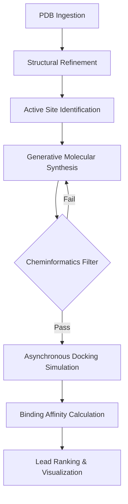

# BioForge

## The Automated Drug-Discovery Pipeline

**BioForge** is an end-to-end computational pipeline that transforms drug design into a rapid, iterative software engineering process. By bridging the gap between genomic identification and physical simulation, BioForge architects and validates novel molecules for specific protein targets using state-of-the-art Generative AI and physics-based docking.

---

## Key Features

- **Target-Centric Design**: Focuses on the application layer, designing molecules tailored to specific protein pockets.
- **AI-Powered Synthesis**: Utilizes LLMs and generative models to architect novel SMILES-based chemical structures.
- **Asynchronous Orchestration**: High-performance FastAPI backend capable of managing distributed docking simulations.
- **Scientific Rigor**: Multi-layered validation using RDKit, Lipinski’s Rule of Five, and AutoDock Vina.
- **Intelligence Layer**: Real-time lead ranking based on binding affinity ($\Delta G$) and synthetic feasibility.

---

## Project Architecture

---

## Technology Stack

| Layer | Technologies |
| :--- | :--- |
| **Scientific Core** | Python, Biopython, RDKit, AutoDock Vina, GNINA |
| **Backend** | FastAPI, TypeScript, Aiohttp, Celery, Redis |
| **Persistence** | Supabase (PostgreSQL), Prisma ORM, Cloudflare R2 |
| **Frontend** | Next.js 15, Tailwind CSS, Three.js, R3F |
| **Infrastructure** | Docker, GitHub Actions, Vercel |

---

## Implementation Roadmap

1.  **Phase 1-2**: Foundation & Benchmarking (Structural ingestion & wrapper validation).
2.  **Phase 3-4**: Orchestration & Design (FastAPI async layer & Generative SMILES).
3.  **Phase 5-6**: Intelligence & Visualization (Lead ranking & 3D Clinician Dashboard).

---

## Getting Started

> [!NOTE]
> BioForge is aligned with 2026 industry standards, shifting from virtual screening to deep physics-based validation. Refer to the [Project Outline](outline.md) for detailed implementation notes.

1.  **Clone the Repository**: `git clone https://github.com/user/BioForge.git`
2.  **Setup Environment**: `pip install -r requirements.txt`
3.  **Run Simulation**: `python scripts/docking_wrapper.py --target PDB_ID`

---

## License

This project is licensed under the MIT License - see the [LICENSE](LICENSE) file for details.
